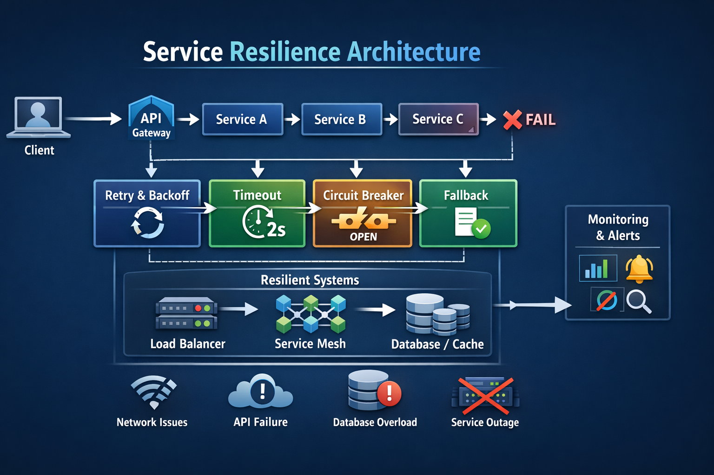
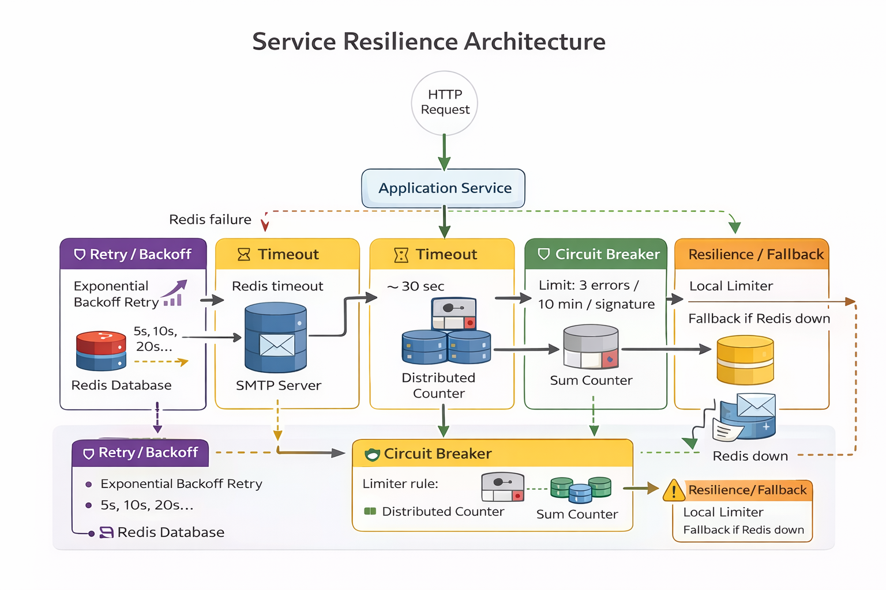
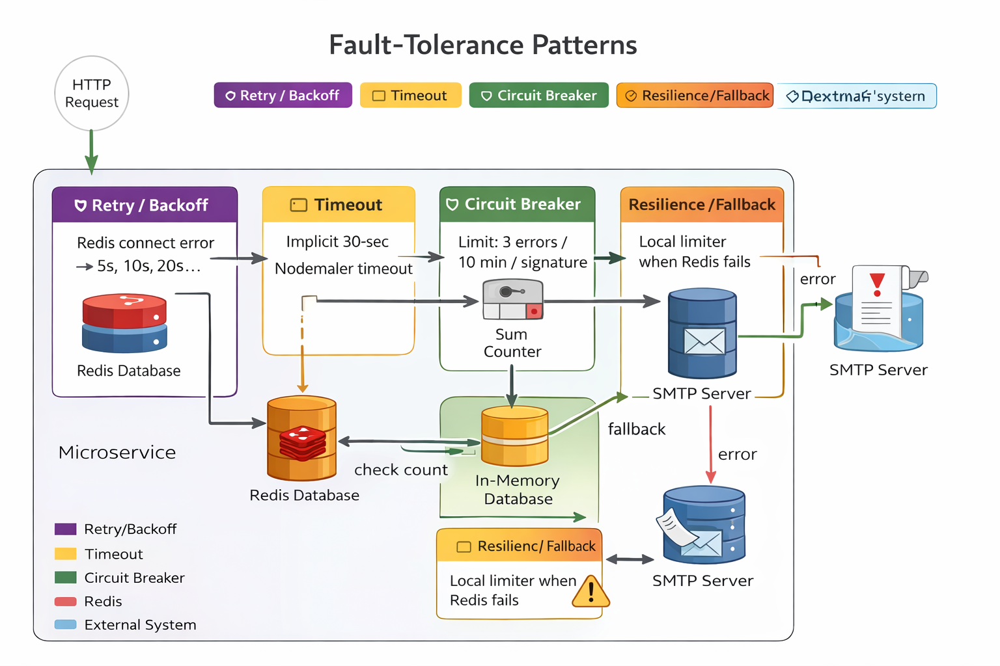

# Service Resilience Architecture
## Building Resilient Microservices: Why Retry, Timeout, Circuit Breaker &amp; Fallback Matter - Service Resilience Architecture

# Fault-Tolerance and Resiliency Mechanisms
# Service Resilience and Fault-Tolerance Patterns

Service resilience is a core architectural capability in distributed systems and microservices. The goal is to **keep the system functional even when some components fail, slow down, or become temporarily unavailable**. In Node.js systems (Express, NestJS, Fastify), resilience is implemented through several **fault-tolerance patterns**.

1.) Retry with backoff

2.) Timeout

3.) Circuit Breaker

4.) Resilience/Fallback

Modern distributed systems will fail at some point — network latency, downstream service outages, database overload, or temporary API failures. The real engineering challenge is not preventing failure entirely, but designing systems that handle failure gracefully.

This is where Service Resilience Architecture becomes critical.

In a typical microservices flow:

Client → API Gateway → Service A → Service B → Service C

If Service C fails, it can trigger a cascading failure across the entire system unless resilience mechanisms are in place.

Here are four essential fault-tolerance patterns every backend engineer should understand and implement:

1️⃣ **Retry with Backoff**
Automatically retry transient failures with exponential delay to avoid retry storms.

2️⃣ **Timeout**
Define strict time limits for external service calls so resources are not blocked indefinitely.

3️⃣ **Circuit Breaker**
Prevent repeated calls to failing services by temporarily blocking requests once error thresholds are reached.

4️⃣ **Fallback**
Return cached data or degraded responses instead of failing completely.

When combined properly, the flow becomes:

Client Request

  → Timeout Protection
  
  → Retry with Backoff
  
  → Circuit Breaker Guard
  
  → Fallback Response
  
This approach helps prevent:

  • Cascading failures
  
  • System overload
  
  • Poor user experience during outages
  

These resilience patterns can be implemented in Node.js ecosystems such as Express.js, NestJS, and Fastify using libraries like circuit breakers, retry policies, and timeout controls.

In distributed systems, resilience is not optional — it is part of the architecture.

## Behavior of Each App

| App         | Redis  | Retry   | Circuit Breaker | Fallback    |
|-------------|--------|---------|-----------------|-------------|
| express-app	| Yes	   | Yes	   | Redis + memory	 | Yes         |
| nest-api	  | Yes	   | Yes	   | Redis + memory	 | Yes         |
| nest-app	  | Yes	   | Yes	   | Redis + memory	 | Yes         |
| fastify-app	| No	   | No	     | Memory only	   | Not needed  |

##  🔍 Common themes
All of the apps are small demo servers whose only external dependencies are:

  - a Redis instance (used for a distributed rate limiter)

  - an SMTP server (used by nodemailer to send the alert emails).

Each app contains:

  - Retry – only on the Redis connection. An exponential‑backoff retryStrategy/reconnectOnError is passed to ioredis in every implementation. (There is no “retry the sendMail call” logic; nodemailer itself will eventually time‑out and reject.)

  - Timeout – implicit rather than explicit. The email‑transport isn’t wrapped in a custom timeout, but the default nodemailer timeout (~30 s) protects the process from hanging. Redis operations also time‑out internally if the socket is lost.

  - Circuit breaker – yes, in all apps. The error‑email functions maintain a counter per signature and, once the configured threshold (ERROR_EMAIL_MAX/ERROR_EMAIL_WINDOW_MS) is exceeded, “open the circuit” and stop sending further alerts. This behaviour is implemented both in‑memory and, when Redis is available, via a Redis‑backed counter – the latter serving as a distributed breaker for multi‑instance deployments.

  - Resilience/fallback – also present in all four. If Redis is unreachable the code logs a warning and falls back to the local in‑memory limiter (or, in the fastify app, to a no‑op that simply allows the email). Email‑send errors are caught and logged without impacting the HTTP response. Redis connection failures are logged and automatically retried.

## ✔️ Conclusion
All four apps do implement the patterns listed for their error‑notification subsystem:

  - Redis clients retry on failure.

  - Calls to external services time‑out (implicitly).

  - A circuit‑breaker/rate‑limiter prevents alert storms.

  - There is graceful degradation when Redis or SMTP are unavailable.

No code crashes the process; failures are logged and the HTTP handlers always return a response.

The goal was to check that each app correctly implements retry, timeout, circuit breaker and fallback, then yes – they are implemented consistently across the board.

---

## 📌 Use Cases

- Microservices Resilience Architecture
- Debugging production incidents
- Performance tuning
- SRE / Platform engineering setups
- Learning LGTM stack

---

## 🤝 Contributing

PRs and improvements are welcome!
Feel free to open issues or suggest enhancements.

---

## ⭐ If this helped you

Give the repo a ⭐ and share it with your team!

---

## 📜 License

MIT License
